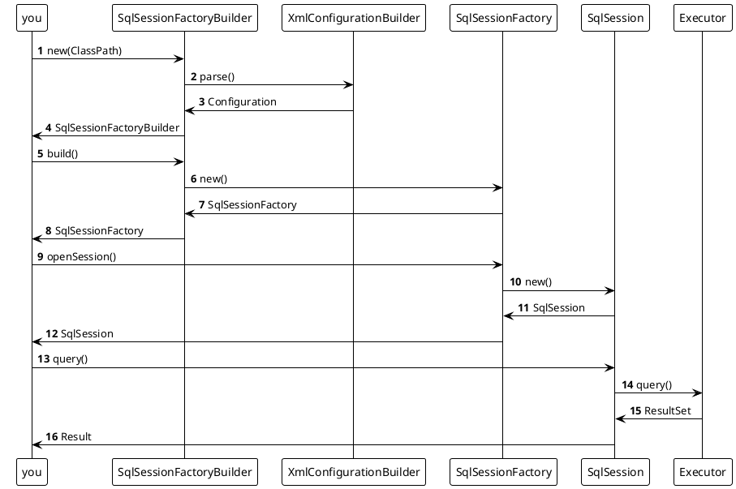

# Mybatis-Agitator V1.0 是什么？

* 参考CSDN以及Mybatis-3源码加上自己的理解完成对Mybatis雏形的搭建，了解Mybatis封装JDBC的核心思路以及运用到的各种设计模式
* 后续版本将继续尝试深入源码完成更多的内容，例如MapperRegistry的管理、缓存、事务、日志等内容

# 前言

* 本文需要对以下Java设计模式有一定了解：
    * 工厂模式
    * Builder模式
    * 代理模式(Mybatis的核心)
    * 直通车：[Mybatis中的设计模式](https://blog.csdn.net/zjjcchina/article/details/122229034)
* 如果你在浏览过程中发现不合理的地方或者您是个大佬，欢迎指正，共同学习
* 参考文章：[天哪！手动编写mybatis雏形竟然长这样](https://blog.csdn.net/qq_27790011/article/details/106331853)

# 我们要干什么？

(做一个东西，最重要的就是明白自己要做个什么东西)

1. 我们希望可以通过XML配置来配置我们的数据源，Mapper.xml路径
2. 我们希望我们的配置可以去读取我们配置的Mapper.xml文件并且解析他
3. 我们希望只通过调用接口方法即可完成查询

# 开工

## 新建项目

### pom.xml

```xml

<dependencies>
    <!--  xml解析-->
    <dependency>
        <groupId>org.dom4j</groupId>
        <artifactId>dom4j</artifactId>
        <version>2.1.3</version>
    </dependency>
    <dependency>
        <groupId>mysql</groupId>
        <artifactId>mysql-connector-java</artifactId>
        <version>8.0.30</version>
    </dependency>
    <!--  连接池-->
    <dependency>
        <groupId>com.alibaba</groupId>
        <artifactId>druid</artifactId>
        <version>1.2.15</version>
    </dependency>
    <dependency>
        <groupId>jaxen</groupId>
        <artifactId>jaxen</artifactId>
        <version>1.1.1</version>
    </dependency>
</dependencies>
```

## 新建我们的配置文件

### resources/configuration.xml

```xml
<?xml version="1.0" encoding="UTF-8" ?>
<configuration>
    <dataSource>
        <property name="driverClassName">com.mysql.cj.jdbc.Driver</property>
        <property name="url">jdbc:mysql://localhost:3306/agitator?serverTimezone=UTC&amp;characterEncoding=utf8&amp;useUnicode=true&amp;useSSL=false</property>
        <property name="username">root</property>
        <property name="password">root</property>
    </dataSource>
    <mapper resource="mapper/UserMapper.xml"/>
</configuration>
```

### resources/mapper/UserMapper.xml

```xml
<?xml version="1.0" encoding="UTF-8" ?>
<mapper namespace="pers.agitator.mybatis.demo.mapper.UserMapper">
    <select id="selectAll" resultType="pers.agitator.mybatis.demo.pojo.User">
        select * from tb_user
    </select>
    <select id="selectByUsername" resultType="pers.agitator.mybatis.demo.pojo.User"
            paramType="pers.agitator.mybatis.demo.pojo.User">
        select * from tb_user where username=#{username}
    </select>
</mapper>
```

## 新建pojo和mapper类

### demo.mapper.UserMapper

```java
package pers.agitator.mybatis.demo.mapper;

import pers.agitator.mybatis.demo.pojo.User;

import java.util.List;

public interface UserMapper {
    List<User> selectAll();

    List<User> selectByUsername(User user);
}
```

### demo.pojo.User

```java
package pers.agitator.mybatis.demo.pojo;

public class User {
    private Integer id;
    private String username;
    private String address;
    // ...getter setter toString
}
```

### 一些常量

```java
package pers.agitator.mybatis.constant;

public class XmlConstant {
    public static final String ROOT_ELEMENT_NAME = "configuration";

    public static final String DATA_SOURCE = "dataSource";

    public static final String PROPERTY = "property";

    public static final String RESOURCE = "resource";

    public static final String PROPERTY_NAME = "name";

    public static final String MAPPER_ID = "id";

    public static final String NAMESPACE = "namespace";

    public static final String PARAM_TYPE = "paramType";

    public static final String RESULT_TYPE = "resultType";
}

```

## 新建我们的Configuration类 用于保存配置

```java
public class Configuration {
    // 用于保存<mapper>
    Map<String, MapperBean> mapperMap = new HashMap<>();
    // 用于根据<dataSource> 生成数据源 
    public DataSource dataSource;
    // ...getter setter
}
```

### 其中MapperBean是用于保存mapper中每一个方法的一些属性，比如id,resultType,paramType等

```java
public class MapperBean {
    private String id;
    private Class<?> resultType;
    private Class<?> paramType;
    private String sql;
    // ... getter setter
}
```

## 开始解析xml配置文件生成Configuration类

### XmlConfigurationBuilder

没什么特别难的，就是解析了xml结构提取配置信息

```java
public class XmlConfigurationBuilder {
    private Configuration configuration;
    private final InputStream in;

    public XmlConfigurationBuilder(InputStream in) {
        newConfig();
        this.in = in;
    }

    private void newConfig() {
        this.configuration = new Configuration();
    }

    public Configuration parse() {
        try {
            SAXReader reader = new SAXReader();
            Document document = reader.read(in);
            Element root = document.getRootElement();

            if (!Objects.equals(root.getName(), XmlConstant.ROOT_ELEMENT_NAME)) {
                throw new ConfigurationException("root must be <{}>", XmlConstant.ROOT_ELEMENT_NAME);
            }
            //获取属性节点
            Properties properties = XmlUtil.coverElementPropertyToProperties(root.element(XmlConstant.DATA_SOURCE));
            // 加载连接池
            DataSource dataSource = DruidDataSourceFactory.createDataSource(properties);
            this.configuration.setDataSource(dataSource);

            // 加载mapper
            List<Node> nodes = root.selectNodes("//mapper");
            XmlMapperBuilder xmlMapperBuilder = new XmlMapperBuilder(configuration);
            for (Node node : nodes) {
                Element mapperElement = (Element) node;
                String mapperResource = mapperElement.attributeValue(XmlConstant.RESOURCE);
                xmlMapperBuilder.loadXmlMapper(ResourceUtil.getResources(mapperResource));
            }
            return configuration;
        } catch (Exception e) {
            throw new ConfigurationException("加载配置出现错误", e);
        }
    }
}
```

### 其中的XmlMapperBuilder就是吧*Mapper.xml解析成MapperBean并存在Configuration中的

```java
public class XmlMapperBuilder {
    private final Configuration configuration;

    public XmlMapperBuilder(Configuration configuration) {
        this.configuration = configuration;
    }

    public void parse(InputStream in) throws DocumentException, ClassNotFoundException {
        Document document = new SAXReader().read(in);

        Element rootElement = document.getRootElement();
        String namespace = rootElement.attributeValue("namespace");
        // 解析 select 标签
        parseSelectElement(rootElement, namespace);
        // 其他1.0先不搞
    }

    private void parseSelectElement(Element rootElement, String namespace) throws ClassNotFoundException {
        List<Node> list = rootElement.selectNodes("//select");

        for (Node node : list) {
            MapperBean mapper = new MapperBean();
            Element element = (Element) node;
            String id = element.attributeValue(XmlConstant.MAPPER_ID);
            mapper.setId(id);
            String paramType = element.attributeValue(XmlConstant.PARAM_TYPE);
            if (StrUtil.isNotBlank(paramType)) {
                mapper.setParamType(Class.forName(paramType));
            }
            String resultType = element.attributeValue(XmlConstant.RESULT_TYPE);
            if (StrUtil.isNotBlank(resultType)) {
                mapper.setResultType(Class.forName(resultType));
            }
            mapper.setSql(element.getTextTrim());
            String key = namespace + "." + id;
            configuration.getMapperMap().put(key, mapper);
        }
    }
}
```

### 到这里，xml配置就都被我们抽象成对象保存在一个Configuration类中了

### 接下来是比较难的部分，核心接口

* Executor(封装JDBC操作)
* SqlSession(为Executor和Configuration搭建桥梁,也是框架对外操作数据库的主要接口)
* SqlSessionFactory(SqlSession工厂接口)



### 以上时序图就是从入口到加载配置到获得SqlSession到调用Executor执行查询的时序，我们一个一个实现

### SqlSessionFactory

```java
public interface SqlSessionFactory {
    SqlSession openSession();
}
```

### SqlSessionFactoryBuilder

```java
public class SqlSessionFactoryBuilder {
    private final InputStream in;

    public SqlSessionFactoryBuilder(String classPath) {
        this(ResourceUtil.getResources(classPath));
    }

    public SqlSessionFactoryBuilder(InputStream in) {
        this.in = in;
    }

    public SqlSessionFactory build() {
        XmlConfigurationBuilder xmlConfigurationBuilder = new XmlConfigurationBuilder(in);
        Configuration configuration = xmlConfigurationBuilder.parse();
        return new DefaultSqlSessionFactory(configuration);
    }

}
```

### 这里面所构建出来的DefaultSqlSessionFactory 是SqlSessionFactory的默认实现 如果下

```java
public class DefaultSqlSessionFactory implements SqlSessionFactory {
    private final Configuration configuration;

    public DefaultSqlSessionFactory(Configuration configuration) {
        this.configuration = configuration;
    }

    @Override
    public SqlSession openSession() {
        return new DefaultSqlSession(configuration);
    }
}
```

### 顺水推舟，看下SqlSession的默认实现

```java
public interface SqlSession extends Closeable {
    <E> List<E> selectList(String statementId, Object... params);
// 暂时不看
//    <E> E getMapper(Class<E> clazz);
}
```

```java
public class DefaultSqlSession implements SqlSession {
    private final Configuration configuration;

    private final Executor executor;

    public DefaultSqlSession(Configuration configuration) {
        this.configuration = configuration;
        this.executor = new SimpleExecutor(configuration);
    }

    @Override
    public void close() throws IOException {
        // 还没实现
    }

    @Override
    public <E> List<E> selectList(String statementId, Object... params) {
        MapperBean mapperBean = configuration.getMapperMap().get(statementId);
        return executor.query(mapperBean, params);
    }
}
```

### 可以看到 sqlSession执行查询的时候其实是委托Executor去完成了

```java
public interface Executor {
    <E> List<E> query(MapperBean mapper, Object... params);
}
```

### SimpleExecutor的过程就相对比较复杂繁多，让我们一个一个说

1. getBoundSql涉及了GenericTokenParser(将参数通过自定义的前缀后缀解析例如前缀#{和后缀})
2. GenericTokenParser做的呢就是吧#{username}读取出来并排除转义字符'\\'，然后由ParameterMappingTokenHandler替换为?再把username存起来
3. 再把解析后的带?的sql以及参数存放到BoundSql
4. 使用PreparedStatement执行sql
5. handleResultSet将结果集映射为指定的ResultType

```java
public class SimpleExecutor implements Executor {
    private final Configuration configuration;

    public SimpleExecutor(Configuration configuration) {
        this.configuration = configuration;
    }

    @Override
    public <E> List<E> query(MapperBean mapper, Object... params) {
        try {
            Connection connection = configuration.getDataSource().getConnection();
            BoundSql boundSql = getBoundSql(mapper);
            PreparedStatement preparedStatement = getPreparedStatement(connection, boundSql, params);
            ResultSet resultSet = preparedStatement.executeQuery();
            return handleResultSet(mapper, resultSet);
        } catch (Exception e) {
            throw new ExecutorException(e);
        }
    }

    private static PreparedStatement getPreparedStatement(Connection connection, BoundSql boundSql, Object... params) throws SQLException {
        String sqlText = boundSql.getSqlText();
        List<ParameterMapping> parameterMappingList = boundSql.getParameterMappingList();

        //获取preparedStatement，并传递参数值
        PreparedStatement preparedStatement = connection.prepareStatement(sqlText);

        for (int i = 0; i < parameterMappingList.size(); i++) {
            ParameterMapping parameterMapping = parameterMappingList.get(i);
            String content = parameterMapping.getContent();
            Object o = ReflectUtil.getFieldValue(params[0], content);
            preparedStatement.setObject(i + 1, o);
        }
        return preparedStatement;
    }

    private <E> List<E> handleResultSet(MapperBean mapper, ResultSet resultSet) throws SQLException, InstantiationException, IllegalAccessException, IntrospectionException, InvocationTargetException {
        List<E> result = new ArrayList<>();
        //封装结果集
        Class<?> resultType = mapper.getResultType();
        while (resultSet.next()) {
            Object obj = resultType.newInstance();
            ResultSetMetaData metaData = resultSet.getMetaData();
            int columnCount = metaData.getColumnCount();
            for (int i = 1; i <= columnCount; i++) {
                String columnName = metaData.getColumnName(i);
                Object value = resultSet.getObject(i);
                PropertyDescriptor propertyDescriptor = new PropertyDescriptor(columnName, resultType);
                Method writeMethod = propertyDescriptor.getWriteMethod();
                writeMethod.invoke(obj, value);
            }
            result.add((E) obj);
        }
        return result;
    }

    private static BoundSql getBoundSql(MapperBean mapper) {
        String sql = mapper.getSql();
        ParameterMappingTokenHandler parameterMappingTokenHandler = new ParameterMappingTokenHandler();
        GenericTokenParser genericTokenParser = new GenericTokenParser("#{", "}", parameterMappingTokenHandler);
        String parseSql = genericTokenParser.parse(sql);
        return new BoundSql(parseSql, parameterMappingTokenHandler.getParameterMappings());
    }
}
```

## 到这里我们就完成了我们的雏形，接下来demo一下

```java
public class User {
    private Integer id;
    private String username;
    private String address;
    // ... getter setter toString
}

public interface UserMapper {
    List<User> selectAll();

    List<User> selectByUsername(User user);
}

public class Main {
    public static void main(String[] args) {
        SqlSessionFactoryBuilder sqlSessionFactoryBuilder = new SqlSessionFactoryBuilder("configuration.xml");
        SqlSessionFactory sqlSessionFactory = sqlSessionFactoryBuilder.build();
        SqlSession sqlSession = sqlSessionFactory.openSession();
        List<User> list = sqlSession.selectList("pers.agitator.mybatis.demo.mapper.UserMapper.selectAll");
        System.out.println(list);
        User user = new User();
        user.setUsername("用户名");
        List<User> list2 = sqlSession.selectList("pers.agitator.mybatis.demo.mapper.UserMapper.selectByUsername", user);
        System.out.println(list2);
    }
}
```

### 可以自行执行以下，这个时候我们看到我们是通过statementId去执行对应的sql，不够优雅，这个时候动态代理就派上用场了！

1. 在SqlSession添加getMapper方法

```java

public interface SqlSession extends Closeable {
    <E> E getMapper(Class<E> clazz);
}

```

2. 实现getMapper方法，读接口生成代理类去生成对应的statementId进而调用select方法

```java
public class DefaultSqlSession implements SqlSession {

    @Override
    public <E> E getMapper(Class<E> clazz) {

        Object proxyInstance = Proxy.newProxyInstance(DefaultSqlSession.class.getClassLoader(), new Class[]{clazz}, ((proxy, method, args) -> {
            String methodName = method.getName();
            String clazzName = method.getDeclaringClass().getName();
            String statementId = clazzName + "." + methodName;
            return selectList(statementId, args);
        }));
        return (E) proxyInstance;
    }
}
```

### demo一下

```java
public class Main {
    public static void main(String[] args) {
        SqlSessionFactoryBuilder sqlSessionFactoryBuilder = new SqlSessionFactoryBuilder("configuration.xml");
        SqlSessionFactory sqlSessionFactory = sqlSessionFactoryBuilder.build();
        SqlSession sqlSession = sqlSessionFactory.openSession();
        User user = new User();
        user.setUsername("用户名");
        UserMapper mapper = sqlSession.getMapper(UserMapper.class);
        System.out.println(mapper.selectAll());
        System.out.println(mapper.selectByUsername(user));
    }
}
```


